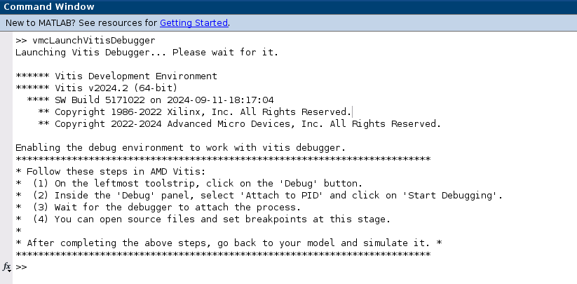
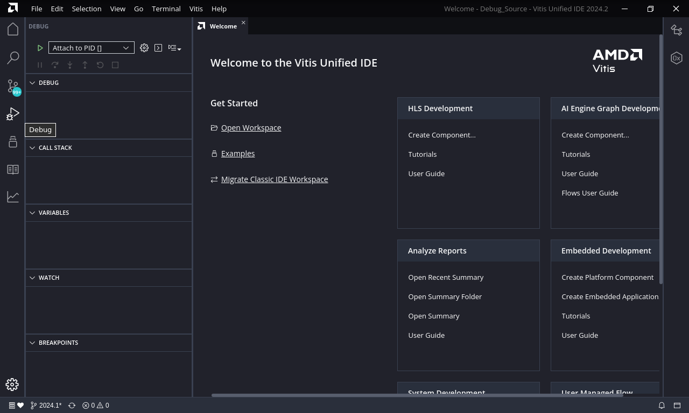
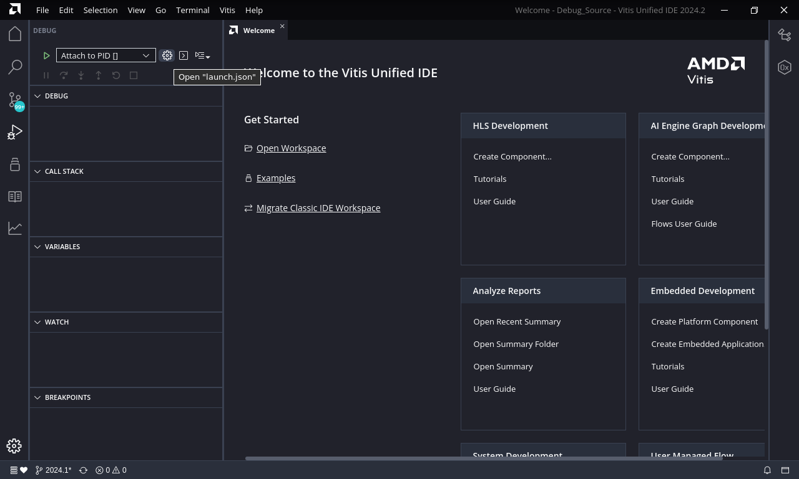
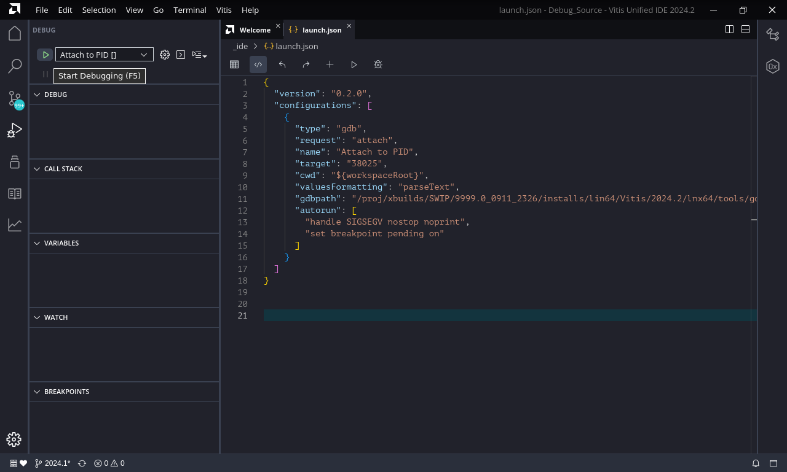
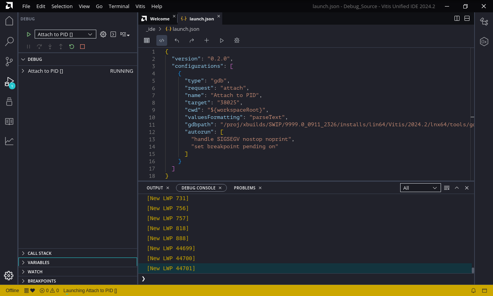
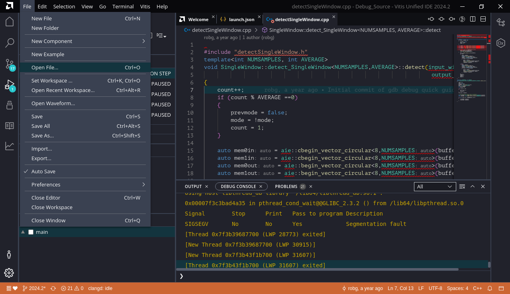

# Debugging C/C++ Source Code

This quick guide will show how to debug C/C++ source code that has been imported into a Vitis Model Composer model. We will demonstrate with an AI Engine kernel, but the same process can be followed to debug imported HLS functions or kernels as well.

## Testbench Model and AI Engine Code

1. Open the model **detect_test.slx**.

This model is a simple unit testbench for an energy detection algorithm that has been implemented as an AI Engine kernel. 

2. Double-click on the **peak_detect** subsystem to open it.

The AI Engine kernel has been brought into Vitis Model Composer using the **AIE Class Kernel** block. The kernel source code can be viewed in the source files `detectSingleWindow.cpp` and `detectSingleWindow.h`.

Now we will simulate the model to see whether the AI Engine kernel produces the desired behavior.

3. On the Simulink toolstrip, click .

This will initialize the simulation and pause it at the first time step (`t=0`). The Array Plot shows the output of the AI Engine kernel.

4. Click  several times to move to the next time step of the simulation.

On some of the execution time steps, the AI Engine kernel will appear to produce garbage samples like this:

 

5. Continue clicking  several times.

Eventually after advancing several more time steps, the AI Engine kernel output will settle into a steady state that looks like below. 

 

This is the desired output of the energy detection algorithm.

The odd transient behavior at the beginning of the algorithm execution is what we would like to debug.

6. Stop the model.

## Debugging the Code using Vitis 

1. Run `vmcLaunchVitisDebugger` from the model directory on the MATLAB Command Window and make sure to open `detect_test.slx` model before running this command.

`vmcLaunchVitisDebugger` creates the required `_ide/launch.json` file in the current directory and launches AMD Vitis Unified IDE for debugging AI Engine kernel code.

2. Click on the **Debug** icon.

3. Click on the **Settings** icon next to **Attach to PID** to open `launch.json` file.

4. Type `feature getpid` in the MATLAB command window to display process ID and make sure the process ID listed in the `launch.json` file is also same. 

5. Click on **Start Debugging** icon as shown below to attach to PID.

6. After attaching to PID, open detectSingleWindow.cpp file to set a break point as shown below.

7. Run the `detect_test.slx` model after setting break point.

8. Break point hitting at line 82 as shown in debug console. 

## Fix The Bug

We learned in the previous section that there is a bug in our code that zeros out the 2 accumulator buffers before execution begins. We can fix this error by advancing the memory pointer location on each loop iteration.

1. Add 2 lines to the loop inside `detectSingleWindow.cpp` to increment the pointers as follows:

2. Save `detectSingleWindow.cpp`. 

3. Run the `detect_test` model.

The AI Engine kernel is rebuilt with the source code changes. We no longer see the transient behavior in the output signal at the beginning of execution.

## Conclusion

In this example, you saw how to use gdb to debug source code that is running in Vitis Model Composer. This approach can be used with AI Engine and HLS C/C++ code.

--------------
Copyright 2024 Advanced Micro Devices, Inc.

Licensed under the Apache License, Version 2.0 (the "License");
you may not use this file except in compliance with the License.
You may obtain a copy of the License at

    http://www.apache.org/licenses/LICENSE-2.0

Unless required by applicable law or agreed to in writing, software
distributed under the License is distributed on an "AS IS" BASIS,
WITHOUT WARRANTIES OR CONDITIONS OF ANY KIND, either express or implied.
See the License for the specific language governing permissions and
limitations under the License.
