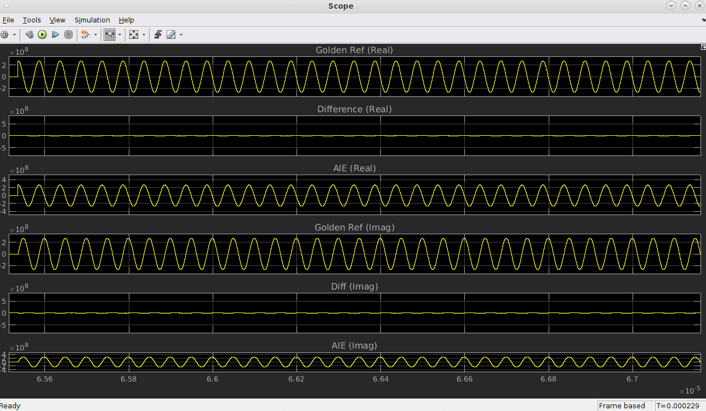
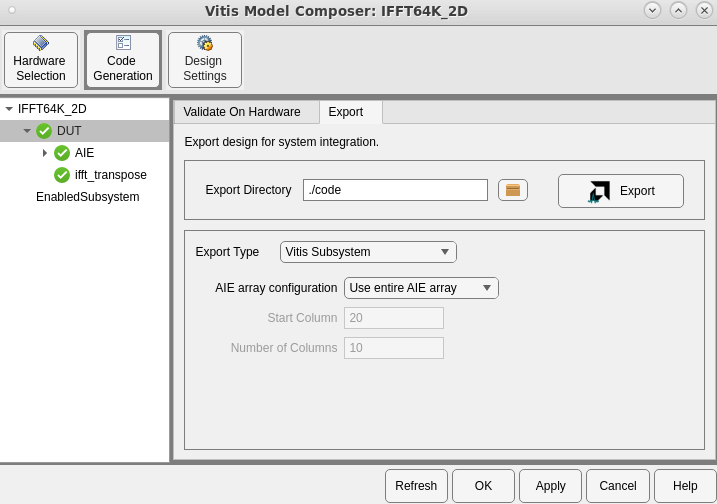
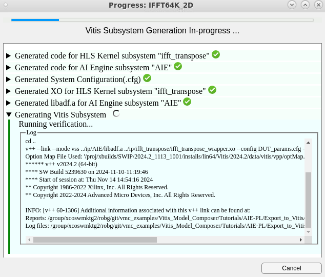
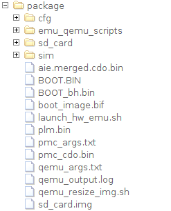

# Export Design from Vitis Model Composer to Vitis

This tutorial will show how to export a heterogeneous design (AI Engine + PL) to Vitis as a Vitis Subsystem (VSS).

## What is a Vitis Subsystem?

A Vitis Subsystem (VSS) is a platform-independent reusable design unit, or *component*, with customizable AIE and PL content, that is integrated into a larger system through Vitis tools.

For more information, see [Embedded Design Development Using Vitis User Guide (UG1701)](https://docs.amd.com/r/en-US/ug1701-vitis-accelerated-embedded/Linking-the-System). 

## Tutorial Design

This tutorial uses the example design 64K-Pt IFFT @ 2 Gsps Using a 2D Architecture.

The figure below shows a block diagram of a 64k-point 2D IFFT hardware design implemented in Versal using AI Engines and PL. The design targets a throughput of 2 GSPS.


The IFFT operation is performed by AI Engine kernels, 5 each for each data dimension. The results of the first dimension are transposed by an HLS kernel implemented in PL. The IFFT of the second dimension is then performed in the AI Engine.

>**NOTE:** The DMA Source and DMA Sink blocks in the PL, shown in the diagram above, will be provided as part of the platform and not the Vitis Subsystem in this tutorial.

For more details on the design, refer to the [Vitis Model Composer example](https://github.com/Xilinx/Vitis_Model_Composer/tree/2024.2/Examples/AIENGINE_plus_PL/AIE_HLS/IFFT64K_2D) and the [Design Example from Vitis-Tutorials](https://github.com/Xilinx/Vitis-Tutorials/tree/2024.2/AI_Engine_Development/AIE/Design_Tutorials/12-IFFT64K-2D).

Open the model `IFFT64K_2D.slx` and examine the `DUT` subsystem, which contains an HLS Kernel and an AI Engine subsystem.


The signals entering and exiting the AI Engine are of `cint32` data type (64 bits wide). The PLIO blocks inside the AI Engine subsystem configure the PLIO width to 64 bits. This means that in hardware, one `cint32` sample will be transferred across each stream on every PL clock cycle. You could potentially increase the PLIO width to 128 bits, so that 2 samples are transferred on each PL clock cycle.

When the model runs, the scope displays the real and imaginary output of the IFFT, which is compared to the original input signal. 



## Export DUT as Vitis Subsystem

A Vitis Subsystem has the following constituent parts:

* Compiled AI Engine application (libadf.a), if the design uses the AI Engine
* Compiled AMD object files (.xo) for any PL kernels in the design
* System configuration (.cfg) file describing how the AI Engine graph and PL kernels are to be connected

To export the Vitis Model Composer IFFT design as a VSS:

1. Double-click the **Vitis Model Composer Hub** block.

2. Select the **DUT** subsystem and the **Export** tab.

3. Select an **Export Type** of **Vitis Subsystem**.



The default configuration is to use the entire AI Engine array for the generated design. You can also specify **Enable array partition** to target the generated design to specific columns in the AIE array. This is useful if the generated AIE graph is to be combined with other graphs later on. For more information see [Compile AI Engine Graph for Independent Partitions](https://docs.amd.com/r/en-US/ug1076-ai-engine-environment/Compile-AI-Engine-Graph-for-Independent-Partitions) in the *AI Engine Tools and Flows User Guide (UG1076)*.

4. Click **Export**.

Vitis Model Composer generates the constituent parts of the VSS listed above, and it also invokes the Vitis linker (`v++`) to generate a Vitis Subsystem. This will take a few minutes.



After code generation is complete, the products can be viewed in the `code` folder.


* The `ip` folder contains subfolders for each subsystem (AI Engine or HLS Kernel) in the design.
    * `AIE` contains the generated code and libadf.a for the AI Engine subsystem.
    * `ifft_transpose` contains the generated code and compiled kernel (.xo) for the transpose HLS Kernel.
* The `vss` folder contains the files used to generate the Vitis Subsystem.
    * The `DUT` folder contains the VSS itself. **This folder contains the files necessary to use the VSS with the Vitis linker.** The libadf.a and .xo are copied here, along with a `DUT.vss` file providing information about the VSS.

In the next section, we will link and package this VSS with an existing Vitis platform.

## Integrating the VSS with Vitis Platform

A Vitis platform is comprised of a base hardware design and optional system software (e.g. operating system and bootloaders) that target a specific device. 

The platform hardware design is encapsulated in an XSA container built in Vivado, with annotations that indicate potential attachment points used by Vitis tools to integrate additional design components including Vitis Subsystems (VSS), compiled AI Engine graphs, HLS and RTL kernels. 

So far in this tutorial we have generated a Vitis Subsystem from Model Composer. In the rest of the tutorial, we will show how to integrate the generated Vitis Subsystem along with data movers to the platform hardware and add system software to create a working HW image that takes in input test vectors and compare the hardware output with reference data. To do that we need:

* Data movers (implemented in HLS code targeting the PL) to move data between the AI Engine and memory.
    * `hls_src/ifft_dma_src`, `hls_src/ifft_dma_sink`
* Test input and reference output waveforms, contained in Vitis data files.
    * `data/sig_i.txt`, `data/sig_o.txt`
* Host application to exercise the DUT with the test input waveform and compare the output to the reference output.
    * `ps_apps/host.cpp`
* System configuration file describing how the data movers are to be connected to the DUT.
    * `vitis/system.cfg`
* Makefiles to build the platform from sources.

To see how to integrate the VSS, we will highlight 3 aspects of the platform: the host application, the system configuration file, and how the Vitis linker and packager are invoked in the Makefile.

### Host Application

Open `ps_apps/host.cpp` to view the host application source code.

The host application is responsible for loading and starting the AI Engine graph and the PL data movers. Because the VSS contains the AI Engine graph, the host application must reflect the graph name contained in the VSS.

Find the section of code labeled **Load and Run AIE graph**.

```
// ------------------------------------------------------------
// Load and Run AIE graph
// ------------------------------------------------------------

auto my_graph  = xrt::graph(my_device, xclbin_uuid, "mygraph");
std::cout << STR_PASSED << "auto my_graph  = xrt::graph(my_device, xclbin_uuid, \"mygraph\")" << std::endl;

my_graph.reset();
std::cout << STR_PASSED << "my_graph.reset()" << std::endl;

my_graph.run(NUM_ITER);
std::cout << STR_PASSED << "my_graph.run( NUM_ITER=" << NUM_ITER << " )" << std::endl;
```

This code calls the XRT API to load and run the AIE graph. The name of the graph, **mygraph**, comes from the generated AI Engine source code (see `code/ip/AIE/src/AIE.cpp`). **mygraph** is a default name provided by Vitis Model Composer.

### System Configuration File

Open `vitis/system.cfg` to view the system configuration file.

Normally, this file instantiates all the PL kernels in the design. However, because the transpose kernel is provided in the VSS, only the data mover PL kernels are instantiated here.

```
# ------------------------------------------------------------
# HLS PL Kernels:
# ------------------------------------------------------------

# Sources/Sinks Data Movers to/from LPDDR/PL:
nk = ifft_dma_src_wrapper:1:dma_src
nk = ifft_dma_snk_wrapper:1:dma_snk
```

This file also describes connectivity between the PL kernels and the AI Engine. However, because connections within the DUT are handled by the VSS, this file only contains connections that occur between the VSS (DUT), data movers, and DDR.

```
# ------------------------------------------------------------
# AXI Stream Connections (PL to AIE)
# ------------------------------------------------------------

# LPDDR to PL DMA SOURCE:
sp=dma_src.mem:LPDDR

# PL DMA Source to AIE:
sc = dma_src.sig_o_0:ai_engine_0.In1
sc = dma_src.sig_o_1:ai_engine_0.In2
sc = dma_src.sig_o_2:ai_engine_0.In3
sc = dma_src.sig_o_3:ai_engine_0.In4
sc = dma_src.sig_o_4:ai_engine_0.In5

# AIE TO PL DMA SINK:
sc = ai_engine_0.Out1:dma_snk.sig_i_0
sc = ai_engine_0.Out2:dma_snk.sig_i_1
sc = ai_engine_0.Out3:dma_snk.sig_i_2
sc = ai_engine_0.Out4:dma_snk.sig_i_3
sc = ai_engine_0.Out5:dma_snk.sig_i_4

# PL DMA SINK to LPDDR
sp=dma_snk.mem:LPDDR
```

The AI Engine port names (`In1`, `Out`, etc.) come from the generated AI Engine source code (and ultimately the Simulink model), which can be viewed at `code/ip/AIE/src/AIE.h`.

### Linking and Packaging

Open the file `vitis/Makefile`. This file automates invoking the Vitis toolchain (`v++`) to link and package the platform.

Find the `${BUILD_DIR}/${XSA}` target, which invokes the Vitis linker.

```
${BUILD_DIR}/${XSA}: ${XO} ${SYSTEM_CFG}
	cd ${BUILD_DIR} && \
		v++ --link --debug --save-temps \
			--target ${TARGET} \
			--platform ${PLATFORM} \
			$(addprefix --config ../, ${SYSTEM_CFG}) \
			$(addprefix ../, ${XO}) \
            		$(addprefix ../, ${VSS}) \
			--output ${XSA} \
			2>&1 | tee vpp_link.log
```

This target invokes `v++` using the `--link` option, and specifies a target (`hw` or `hw_emu`) and platform (`xilinx_vck190_base_202420_1` in this case). The linker takes the system configuration file, data mover PL kernels, and VSS as inputs to produce an XSA. The inputs to the linker are specified in the Makefile as follows:

```
XO              := ../hls_src/ifft_dma_src/ifft_dma_src_wrapper.xo \
                   ../hls_src/ifft_dma_snk/ifft_dma_snk_wrapper.xo
VSS		:= ../code/vss/DUT/DUT.vss
SYSTEM_CFG      := system.cfg
```
Note that the VSS is pulled from the `code` folder you generated earlier from Vitis Model Composer.

The `${SD_CARD}` target invokes the Vitis packager.

```
${SD_CARD}: ${BUILD_DIR}/${XSA} ${PS_EXE} ${KERNEL_IMAGE} ${ROOTFS} ${STIMULUS_IO}
	cd ${BUILD_DIR} && \
		v++ --package --debug --save-temps \
			--target ${TARGET} \
			--platform ${PLATFORM} \
			--package.out_dir ${SD_CARD} \
			--package.boot_mode=sd \
			--package.image_format=ext4 \
			--package.kernel_image=${KERNEL_IMAGE} \
			--package.rootfs=${ROOTFS}  \
			--package.defer_aie_run \
            		${XSA} \
            		$(addprefix ../, ${VSS}) \
			$(addprefix --package.sd_file=../, ${PS_EXE}) \
			$(addprefix --package.sd_file=../,${STIMULUS_IO}) \
			$(addprefix --package.sd_file=../,embedded_exec.sh) \
			2>&1 | tee vpp_pack.log
```

This target creates an `sd_card.img` that can be loaded onto a board, in this case a VCK190. The packager takes as inputs the VSS and the XSA that was generated by the linker.

## Building and Running the Project

The `Makefile` contained in this folder invokes other Makefiles in the project to build each component, then link and package the overall platform.

>**NOTE:** To build the Vitis project, make sure you have completed the following steps:
> 1. [Configure your environment](https://docs.amd.com/r/en-US/ug1393-vitis-application-acceleration/Setting-Up-the-Vitis-Environment) to run Vitis.
> 2. Set the `PLATFORM_REPO_PATHS` environment variable to point to the `base_platforms` folder inside the Vitis installation directory.
> 3. Download and install the [Common Images for Embedded Vitis Platforms](https://www.xilinx.com/support/download/index.html/content/xilinx/en/downloadNav/embedded-design-tools/2024-2.html).
> 4. Set the environment variable `COMMON_IMAGE_VERSAL` to the full path where you have downloaded the common images.

1. Run `make all TARGET=hw_emu` in this folder in a terminal window to build and package the project for hardware emulation.

The build process will take some time. When complete, the outputs will appear in a new folder named `package`.



In addition to the `sd_card.img`, a script `launch_hw_emu.sh` is created to automate launching of the hardware emulator.

2. From within the `package` folder, launch hardware emulation as follows: `./launch_hw_emu.sh -run-app embedded_exec.sh`.

The emulator will start, and the hardware image will boot into Linux. The contents of the SD card image are displayed, and the `vitis/embedded_exec.sh` script will automatically run to launch the host application.

```
versal-rootfs-common-20242:/mnt# INFO:Running embedded_exec.sh
Run app command sent to console
ls
BOOT.BIN          a.xclbin          embedded_exec.sh  sig_i.txt
Image             boot.scr          host.exe          sig_o.txt
versal-rootfs-common-20242:/mnt# ./embedded_exec.sh
```

As the host application runs, status messages are printed to the display as the AI Engine graph and PL kernels start. Eventually the host application will wait while the kernels execute:

```
INFO:    Waiting for kernels to end...
```

It will take several minutes for the kernels to execute in hardware emulation. When the kernels finish, the host application will compare the DUT output to the golden reference on a sample-by-sample basis. If the results match, the simulation will pass.

```
ss: 65532  Gld: 8388273 -12839  Act: 8388273 -12839  Err: 0 0
ss: 65533  Gld: 8388344 -9502  Act: 8388344 -9502  Err: 0 0
ss: 65534  Gld: 8388390 -6419  Act: 8388390 -6419  Err: 0 0
ss: 65535  Gld: 8388462 -3082  Act: 8388462 -3082  Err: 0 0
Level: 16384
Max Error: 256

--- PASSED ---

```

## Conclusion

**Congratulations!** In this tutorial, you saw how to export a heterogeneous design (AI Engine + PL) to Vitis as a Vitis Subsystem (VSS) and build a complete design targeting the board.


---

&copy; Copyright 2024 Advanced Micro Devices, Inc.

