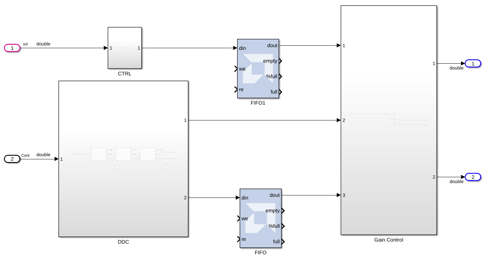
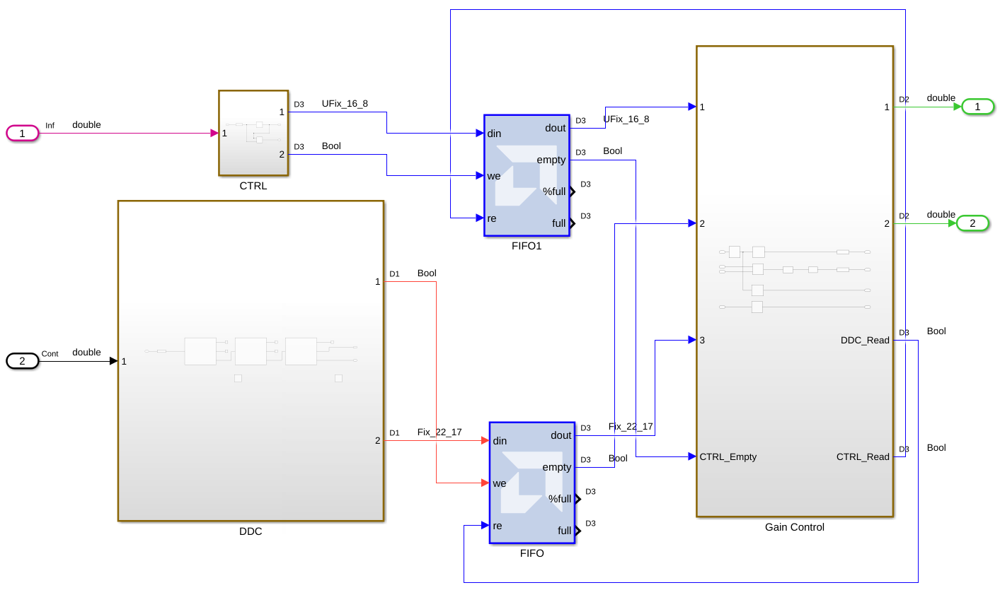
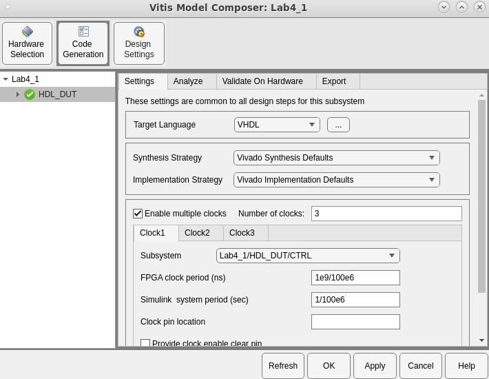
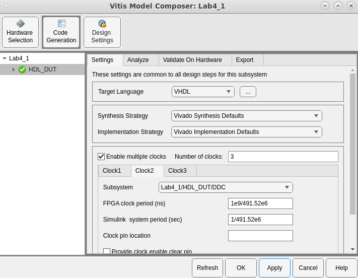

# Lab 4: Working with Multi-Rate Systems

In this lab exercise, you will learn how to efficiently implement designs with multiple data rates using multiple clock domains.

### Objectives

After completing this lab, you will be able to:

* Understand the benefits of using multiple clock domains to implement multi-rate designs.
* Understand how to isolate hierarchies using FIFOs to create safe channels for transferring asynchronous data.
* How to implement hierarchies with different clocks.

### Procedure

This lab has three primary parts:

* In Step 1, you will learn how to create hierarchies between the clock domains.
* In Step 2, you will learn how to add FIFOs between the hierarchies.
* In Step 3, you will learn how to add separate clock domains for each hierarchy.

## Step 1: Creating Clock Domain Hierarchies

In this step you will review a design in which different parts of the design operate at different data rates and partition the design into subsystems to be implemented in different clock domains.

1. Invoke Vitis Model Composer:
    - On Windows systems select **Windows > AMD Design Tools > Vitis Model Composer 2024.2.**
    - On Linux systems, type `model_composer` at the command prompt.

2. Navigate to the Lab4 folder: `\HDL_Library\Lab4.`

3. At the command prompt, type open `Lab4_1.slx.`

This opens the Simulink design shown in the following figure. This design is composed of three basic parts:

- The channel filter digitally converts the incoming signal (491.52 MSPS) to near baseband (61.44 MSPS) using a classic multi-rate filter: the use of two half-band filters followed by a decimation of 2 stage filter, which requires significantly fewer coefficients than a single large filter.
- The output section gain-controls the output for subsequent blocks which will use the data.
- The gain is controlled from the POWER_SCALE input.
    


4. Click the Run simulation button to simulate the design.

In the following figure Sample Time Display is enabled with colors (right-click in the canvas, **Sample Time Display > Colors**), and shows clearly that the design is running at multiple data rates.


The Vitis Model Composer environment automatically propagates the different data rates through the design.

When a multi-rate design such as this is implemented in hardware, the most optimal implementation is to use a clock at the same frequency as the data; however, the clock is abstracted away in this environment. The following methodology demonstrates how to create this ideal implementation in the most efficient manner.

To efficiently implement a multi-rate (or multi-clock) design using Vitis Model Composer you should capture each part running at the same data rate (or clock frequency) in its own hierarchy. The separate hierarchies should then be linked with FIFOs.

The current design has two obvious, and one less obvious, clock domains:

* The gain control input POWER_SCALE could be configurable from a CPU and therefore can run at the same clock frequency as the CPU.
* The actual gain-control logic on the output stage should run at the same frequency as the output data from the FIR. This will allow it to more efficiently connect to subsequent blocks in the system.
* The less obvious region is the filter-chain. Remember from Lab 1 that complex IP provided with Vitis Model Composer, such as the FIR Compiler, automatically takes advantage of over-sampling to provide the most efficient hardware. For example, rather than use 40 multipliers running at 100 MHz, the FIR Compiler will use only eight multipliers if clocked at 500 MHz (= 40\*100/500). The entire filter chain can therefore be grouped into a single clock domain. The first FIR Compiler instance will execute at the maximum clock rate and subsequent instances will automatically take advantage of over-sampling.

You will start by grouping these regions into different hierarchies.

5. Select all the blocks in the filter chain – all those to be in the same clock domain, including the FDATool instances - as shown in the following figure.


6. Select Create Subsystem to create a new subsystem.

7. Select the instance name subsystem and change this to DDC to obtain the design shown.


8. Select the components in the output path and create a subsystem named Gain Control.


     
9. Finally, select the Gateway In instance **POWER_SCALE** to create a new subsystem called CTRL. The final grouped design is shown in the following figure.
     
When this design is complete, the logic within each subsystem will execute at different clock frequencies. The clock domains might not be synchronous with each other. There is presently nothing to prevent incorrect data being sampled between one subsystem and another subsystem.

In the next step you will create asynchronous channels between the different domains to ensure data will asynchronously and safely cross between the different clock domains when the design is implemented in hardware.     
     
## Step 2

In this step you will implement asynchronous channels between subsystems using FIFOs. The data in FIFOs operates on a First-In-First-Out (FIFO) basis, and control signals ensure data is only read when valid data is present and data is only written when there is space available. If the FIFO is empty or full the control signals will stall the system. In this design the inputs will always be capable of writing and there is no requirement to consider the case for the FIFO being full.

There are two data paths in the design where FIFOs are required:

* Data from CTRL to Gain Control.
* Data from DDC to Gain Control.

1. Left-click anywhere in the canvas and type `FIFO`.

2. Select FIFO from the menu to add a FIFO to the design.

3. Connect the data path through instance FIFO. Delete any existing connections to complete this task.
    - Connect `CTRL/Out1` to `FIFO/din`.
    - Connect `FIFO/dout` to `Gain Control/In1`.

4. Make a copy of the FIFO instance (right-click and drag to copy and paste).

5. Connect the data path through instance FIFO1. Delete any existing connections to complete this task.
    - Connect `DDC/Out2` to `FIFO1/din`.
    - Connect `FIFO1/dout` to `Gain Control/In3`.

You have now connected the data between the different domains and have the design shown in the following figure.



You will now connect up the control logic signals to ensure the data is safely passed between domains.
    - From the CTRL block a write enable is required. This is not currently present and needs to be created.
    - From the DDC block a write enable is required. The data_tvalid from the final FIR stage can be used for this.
    - The Gain Control must generate a read enable for both FIFOs. You will use the empty signal from the FIFOs and invert it; if there is data available, this block will read it.


6. Double-click the **CTRL** block to open the subsystem.

7. Left-click in the canvas and type to add these blocks:
    - Delay (AMD Toolbox/HDL)
    - Relational (AMD Toolbox/HDL)

8. Select instance Out1 and make a copy (right-click and drag to copy and paste).

9. Double-click the **Relational** block to open the Properties Editor.

10. Use the Comparison drop-down menu to select **a!=b** and click **OK**.

11. Connect the blocks as shown in the following figure.


This will create an output strobe on Out2 which will be active for one cycle when the input changes, and be used as the write-enable from CTRL to the Gain Control (the FIFO block at the top level).

12. Click the Up to Parent toolbar button to return to the top level.

13. Double-click the instance Gain Control to open the subsystem.

14. Left-click the canvas and type to add these blocks:
    - Inverter (AMD Toolbox/HDL)
    - Inverter (for a total of two inverters)
    - Delay (AMD Toolbox/HDL)

15. Select the instance Out1 and make a copy `Out3` (right-click and drag to copy and paste).
    - Rename Out3 to `DDC_Read`

16. Select instance Out1 and make a copy `Out3` (right-click and drag to copy and paste).
    - Rename Out3 to `CTRL_Read`

17. Select instance In1 and make a copy `In4` (right-click and drag to copy and paste).
    - Rename In4 to `CTRL_Empty`

18. Connect the blocks as shown in the following figure


The FIFO empty signal from the top-level Gain Control FIFO (FIFO) block is simply an inverter block used to create a read-enable for the top-level DDC FIFO (FIFO1). If the FIFO is not empty, the data will be read.

Similarly, the FIFO empty signal from the top-level DDC FIFO (FIFO1) is inverted to create a FIFO read-enable.

This same signal will be used as the new `data_tvalid` (which was In2). However, because the FIFO has a latency of 1, this signal must be delayed to ensure this control signal is correctly aligned with the data (which is now delayed by 1 through the FIFO).

19. Use the **Up to Parent** toolbar button to return to the top level.

This shows the control signals are now present at the top level.


You will now complete the final connections.

20. Connect the control path through instance FIFO. Delete any existing connections to complete this task.
    - Connect `CTRL/Out2` to `FIFO/we`.
    - Connect `FIFO/empty` to `Gain Control/CTRL_Empty`.
    - Connect `Gain Control/CTRL_Read` to `FIFO/re`.

21. Connect the control path through instance FIFO1. Delete any existing connections to complete this task.
    - Connect `DDC/Out1` to `FIFO1/we`.
    - Connect `FIFO1/empty` to `Gain Control/In2`.
    - Connect` Gain Control/DDC_Read` to `FIFO1/re`.



22. Click the **Run simulation** button to simulate the design and confirm the correct operation – you will see the same results as Step 1 action 4.

In the next step, you will learn how to specify different clock domains are associated with each hierarchy.

## Step 3: Specifying Clock Domains

In this step you will specify a different clock domain for each subsystem.

1. Double-click the Model Composer Hub block.

2. Select the **Settings** tab.

3. Click **Enable multiple clocks**.

4. Change "Number of clocks" to 3.

> 📝 **Note**: There are now separate tabs (Clock1, Clock2, Clock3) to set the different clocks in the design. Each of these clocks will be associated with one of the subsystems (CTRL, Gain Control, DDC) in the design).

You will specify a new clock rate for the CTRL block. This block will be clocked at 100 MHz and accessed using an AXI4-Lite interface.

5. Select the **Clock1** tab.

6. Select the Subsystem `Lab4/HDL_DUT/CTRL`.

7. Set the **FPGA clock period** to `1e9/100e6`.

8. Set the **Simulink system period** to `1/100e6`.



The DDC block uses the same clock frequency as the original design, 491 MHz, because this is the rate of the incoming data.

9. Select the **Clock2** tab.

10. Select the Subsystem `Lab4/HDL_DUTDDC`.

11. Set the **FPGA clock period** to `1e9/491.52e6`.

12. Set the **Simulink system period** to `1/491.52e6`.



You will now specify a new clock rate for the Gain Control block. The Gain Control block will be clocked at the same rate as the output from the DDC, 61.44 MHz.

13. Select the **Clock3** tab.

14. Select the Subsystem `Lab4/HDL_DUT/Gain Control`.

15. Set the **FPGA clock period** to `1e9/61.44e6`.

16. Set the **Simulink system period** to `1/61.44e6`.


17. Click **Apply** and **OK** to close the Model Composer Hub.

18. Double-click the HDL DUT block and then the CTRL block to navigate into the subsystem.

19. Double-click the Gateway In instance **POWER_SCALE** to open the Properties Editor.

20. Change the **Sample period** to `1/100e6` to match the new frequency of this block.

In the Implementation tab, note that the Interface is set to AXI4-Lite. This will ensure this port is implemented as a register in an AXI4-Lite interface.

21. Save the design.

22. Click the **Run simulation** button to simulate the design and confirm the same results as earlier.

The design will now be implemented with three clock domains.

23. Double-click the top-level **Model Composer Hub** block.

24. On the **Export** tab, change the **Export Type** to HDL Netlist.

24. Click **Export** to compile the design into a hardware description.

25. When generation completes, click **OK** to dismiss the Progress dialog box.

26. Click **OK** to dismiss the Model Composer Hub.

27. Open the file `./Lab4/netlist/ip/HDL_DUT/src/sysgen/hdl_dut.vhd` to confirm the design is using three clocks, as shown in the following.
```
entity hdl_dut is
  port (
    adc_in : in std_logic_vector( 16-1 downto 0 );
    ddc_clk : in std_logic;
    ctrl_clk : in std_logic;
    gain_control_clk : in std_logic;
``` 

### Summary 

In this lab, you learned how to create separate hierarchies for portions of the design which are to be implemented with different clock rates. You also learned how to isolate those hierarchies using FIFOs to ensure safe asynchronous transfer of the data and how to specify the clock rates for each hierarchy.

The following `solution` directory contains the final Vitis Model Composer (\*.slx) files for this lab. The solution directory does not contain the IP output from Vitis Model Composer or the files and directories generated by Vivado.
```
/HDL_Library/Lab4/solution
```
* The results from Step 1 are provided in file `Lab4_1_sol.slx`
* The results from Step 2 are provided in file `Lab4_2_sol.slx`
* The final results from Step 3 are provided in file `Lab4_3_sol.slx`


--------------
Copyright 2024 Advanced Micro Devices, Inc.

Licensed under the Apache License, Version 2.0 (the "License");
you may not use this file except in compliance with the License.
You may obtain a copy of the License at

    http://www.apache.org/licenses/LICENSE-2.0

Unless required by applicable law or agreed to in writing, software
distributed under the License is distributed on an "AS IS" BASIS,
WITHOUT WARRANTIES OR CONDITIONS OF ANY KIND, either express or implied.
See the License for the specific language governing permissions and
limitations under the License.